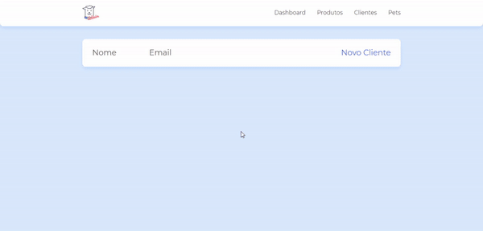

# Petshop-2

Project created in one of Alura's JavaScript courses to learn about CRUD with asynchronous JavaScript. <br />

In it I learned how: <br />

- To create a CRUD using the fetch method and HTTP verbs;
- To consume data from an API and displaying it on the front-end;
- To use the fetch method to consume data from an API;
- To manipulate HTTP verbs through the fetch method;
- Promises work in JavaScript.
  
# Overview



# How to run

```
# Clone this repository
$ git clone https://github.com/velleeda/Petshop-2

# Go to the directory
$ cd Petshop-2
```
  
```
# Install Dependencies
$ npm install

# Install browser-sync
$ npm install -g browser-sync

# Run browser-sync
$ browser-sync start --server --file . --host --port 5000 --startPath telas/lista_cliente.html

# Run Server
$ npm run server
```
